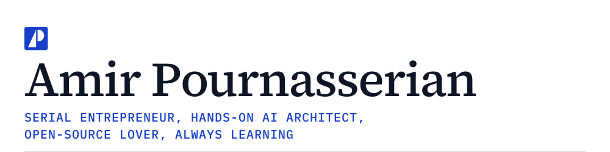
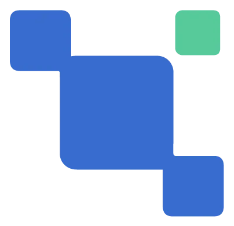
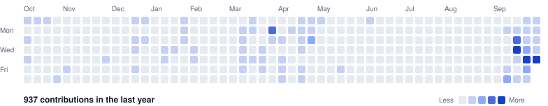

<picture>
  <source media="(prefers-color-scheme: dark)" srcset="assets/banner-dark.svg">
  
</picture>

  
  

  
  
  
  

I build AI and platform systems that have to keep working once they meet production, compliance and scale. Over twenty years of it, so far.

Right now I lead AI platform architecture for the guest-facing AI systems at Four Seasons Hotels and Resorts. Before that I founded and ran a banking software company, led the build of a real-time tracking system for Canada's Department of National Defence, designed a travel booking platform, and started two IoT companies. I still like shipping software, not just architecting it, which is why FluentCMS and YeSvelte exist.

## Stack

<table>
  <tr>
    <td align="right" valign="top" nowrap><b>AI &amp; agents</b></td>
    <td>
      
      
      
      
      
      
      
      
      
    </td>
  </tr>
  <tr>
    <td align="right" valign="top" nowrap><b>Platform</b></td>
    <td>
      
      
      
      
      
      
      
      
      
      
    </td>
  </tr>
  <tr>
    <td align="right" valign="top" nowrap><b>Front end</b></td>
    <td>
      
      
      
      
      
      
    </td>
  </tr>
  <tr>
    <td align="right" valign="top" nowrap><b>IoT &amp; embedded</b></td>
    <td>
      
      
      
      
      
      
      
    </td>
  </tr>
  <tr>
    <td align="right" valign="top" nowrap><b>Observability</b></td>
    <td>
      
      
      
      
    </td>
  </tr>
  <tr>
    <td align="right" valign="top" nowrap><b>Data &amp; ML</b></td>
    <td>
      
      
      
      
    </td>
  </tr>
</table>

The long version, with what each of these was used for, is under [Expertise](https://pournasserian.com/expertise) on my site.

## Open source

<table>
  <tr>
    <td width="96" align="center" valign="middle">
      
    </td>
    <td valign="top">
      <a href="https://github.com/fluentcms/FluentCMS"><b>FluentCMS</b></a> 
      An open-source CMS for .NET, built on ASP.NET Core and Blazor, that works as both a page-building CMS and a headless CMS on one API. 
      
      
      
       
      <a href="https://fluentcms.com">fluentcms.com</a> · <a href="https://www.nuget.org/profiles/fluentcms">NuGet packages</a> · <a href="https://discord.gg/WyqYuC6YbY">Discord</a>
    </td>
  </tr>
  <tr>
    <td width="96" align="center" valign="middle">
      
    </td>
    <td valign="top">
      <a href="https://github.com/yesvelte/yesvelte"><b>YeSvelte</b></a> 
      Svelte components whose look is a swappable theme: Tabler (Bootstrap) or daisyUI (Tailwind). Switch themes by swapping one stylesheet. 
      
      
       
      <a href="https://www.yesvelte.com">yesvelte.com</a>
    </td>
  </tr>
  <tr>
    <td width="96" align="center" valign="middle">
      
    </td>
    <td valign="top">
      <a href="https://github.com/ubeac/api.ubeac.io"><b>uBeac</b></a> 
      An IoT platform I founded in 2017 that turned off-the-shelf Bluetooth gateways into live building dashboards in minutes. Acquired in 2020, and now published as a reference architecture. 
      
       
      <a href="https://github.com/ubeac/api.ubeac.io">Backend on GitHub</a>
    </td>
  </tr>
</table>

Each project has its own page under [Open Source](https://pournasserian.com/open-source) on my site.

## Samples

Smaller things, kept in the open:

- [agent-framework-sample](https://github.com/pournasserian/agent-framework-sample): a Blazor web application on .NET 10 with 24 interactive samples of the Microsoft Agent Framework, in six categories.
- [claude-quickstarts-dotnet](https://github.com/pournasserian/claude-quickstarts-dotnet): .NET ports of two of Anthropic's Claude quickstarts, the customer-support agent and the autonomous-coding harness, rebuilt on the Microsoft Agent Framework.

## Activity

  <picture>
    <source media="(prefers-color-scheme: dark)" srcset="assets/heatmap-dark.svg">
    
  </picture>

  <picture>
    <source media="(prefers-color-scheme: dark)" srcset="https://github-stats-extended.vercel.app/api?show_icons=true&include_all_commits=true&hide_rank=true&hide=stars%2Ccontribs&card_width=400&username=pournasserian&bg_color=131a27&border_color=253046&border_radius=4&title_color=e7ebf3&text_color=aab4c6&icon_color=8ca8ff">
    
  </picture>
  <picture>
    <source media="(prefers-color-scheme: dark)" srcset="https://github-stats-extended.vercel.app/api/top-langs/?layout=compact&card_width=400&size_weight=0&count_weight=1&langs_count=6&hide=jupyter%20notebook&username=pournasserian&bg_color=131a27&border_color=253046&border_radius=4&title_color=e7ebf3&text_color=aab4c6&icon_color=8ca8ff">
    
  </picture>

  <picture>
    <source media="(prefers-color-scheme: dark)" srcset="https://streak-stats.demolab.com?user=pournasserian&card_width=440&border_radius=4&background=131a27&border=253046&stroke=253046&ring=8ca8ff&fire=8ca8ff&currStreakNum=e7ebf3&sideNums=e7ebf3&currStreakLabel=8ca8ff&sideLabels=aab4c6&dates=8792a7">
    
  </picture>
  <picture>
    <source media="(prefers-color-scheme: dark)" srcset="https://github-profile-summary-cards.vercel.app/api/cards/productive-time?username=pournasserian&utcOffset=-5&theme=github_dark&bg_color=131a27&border_color=253046&title_color=e7ebf3&text_color=aab4c6&icon_color=8ca8ff&chart_color=8ca8ff">
    
  </picture>

---

Colophon: the banner is typeset to match [pournasserian.com](https://pournasserian.com), with Source Serif 4 and IBM Plex Mono drawn as SVG paths so it needs no web fonts. The heatmap is drawn once a day by [a script in this repo](scripts/heatmap.py) from GitHub's own contribution data. The badges are drawn by [a second script](scripts/badges.py), with brand icons from [Simple Icons](https://simpleicons.org), and it runs alongside the heatmap so star counts and versions stay current. Cards by [github-stats-extended](https://github.com/stats-organization/github-stats-extended), [streak-stats](https://github.com/DenverCoder1/github-readme-streak-stats) and [profile-summary-cards](https://github.com/vn7n24fzkq/github-profile-summary-cards). Everything follows GitHub's light and dark themes.
